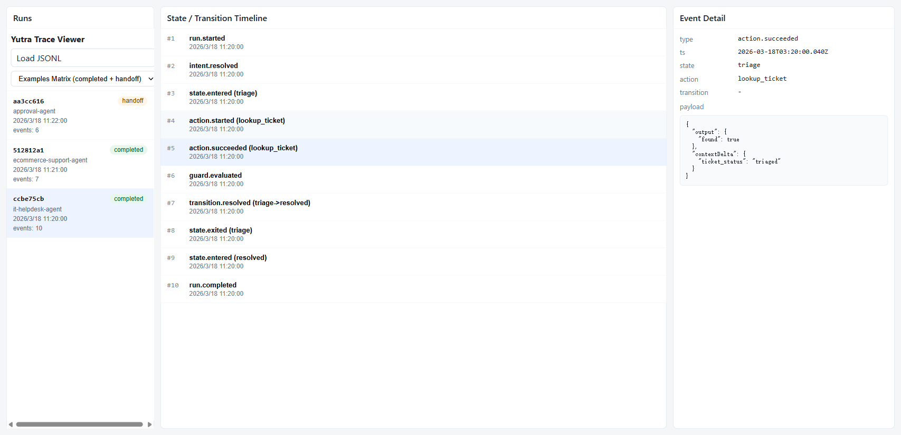
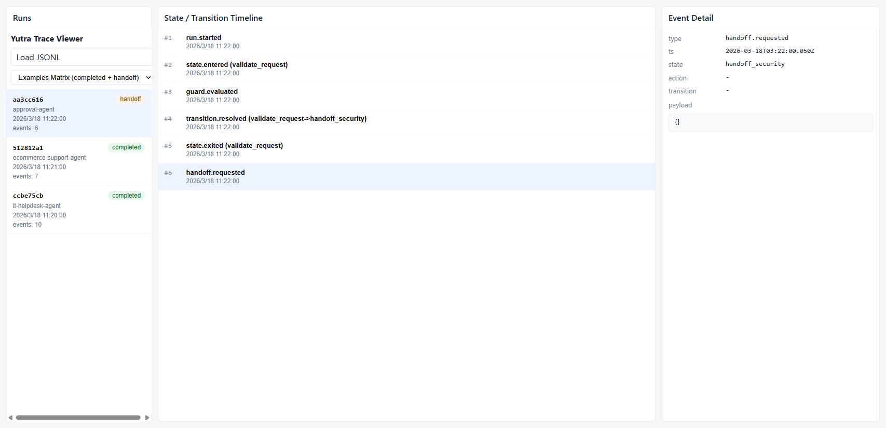

# Yutra

Yutra is an Agent Execution Standard and Reference Runtime.

## Why This Exists

- Agent workflow is complex.
- Prompt-only agent behavior is hard to control.
- Enterprises need traceable execution.

## Non-goals (Current Stage)

Yutra is currently not:

- a visual workflow platform,
- a chat SaaS shell,
- a multi-tenant admin backend,
- an LLM-first orchestration system.

## Minimal DSL Example

```yaml
agent: it-helpdesk-agent
initial_state: triage
states:
  triage:
    actions:
      - lookup_ticket
    transitions:
      - to: resolved
        when: ctx.ticket_has_solution == true
  resolved:
    actions:
      - close_ticket
    final: true
actions:
  - name: lookup_ticket
  - name: close_ticket
```

## Quickstart

```bash
pnpm install
pnpm verify
```

## Real Run Commands

```bash
pnpm exec yutra validate examples/it-helpdesk/agent.yutra.yaml
pnpm exec yutra run examples/it-helpdesk/agent.yutra.yaml --input examples/it-helpdesk/demo-inputs/case1.json
pnpm exec yutra trace list --trace-file .yutra/traces/events.jsonl
pnpm --filter @yutra/viewer dev
```

## Examples Matrix

- IT Helpdesk: state machine + tools + branch transitions.
- E-commerce Support: SOP + knowledge + ticket-oriented tool flow.
- Approval Agent: guard + approval chain + handoff.

## Trace Viewer

Viewer is intentionally minimal and three-column only:

- Left: Run list
- Middle: State/Transition timeline
- Right: Event detail

Localization:

- Supports English and ÖÐÎÄ£¨¼òÌ壩 UI switching.
- Switching locale only changes UI labels.
- Trace event type strings and payload raw fields remain unchanged.

Screenshots:




## Documentation Map

- [Execution Standard](docs/execution-standard.md)
- [Tool Interface](docs/tool-interface.md)
- [Knowledge Interface](docs/knowledge-interface.md)
- [LLM Interface](docs/llm-interface.md)
- [Example Walkthrough](docs/example-walkthrough.md)
- [Demo Script](docs/demo-script.md)
- [Release Checklist](docs/release-checklist.md)
- [Contributing](CONTRIBUTING.md)
- [Agent Collaboration Rules](AGENTS.md)
- [Security](SECURITY.md)
- [Support](SUPPORT.md)

## Repository Layout

```text
packages/
  spec/
  dsl/
  runtime/
  trace/
  tool-core/
  knowledge-core/
  llm-core/
  cli/
  viewer/

examples/
  it-helpdesk/
  ecommerce-support/
  approval-agent/

docs/
```
